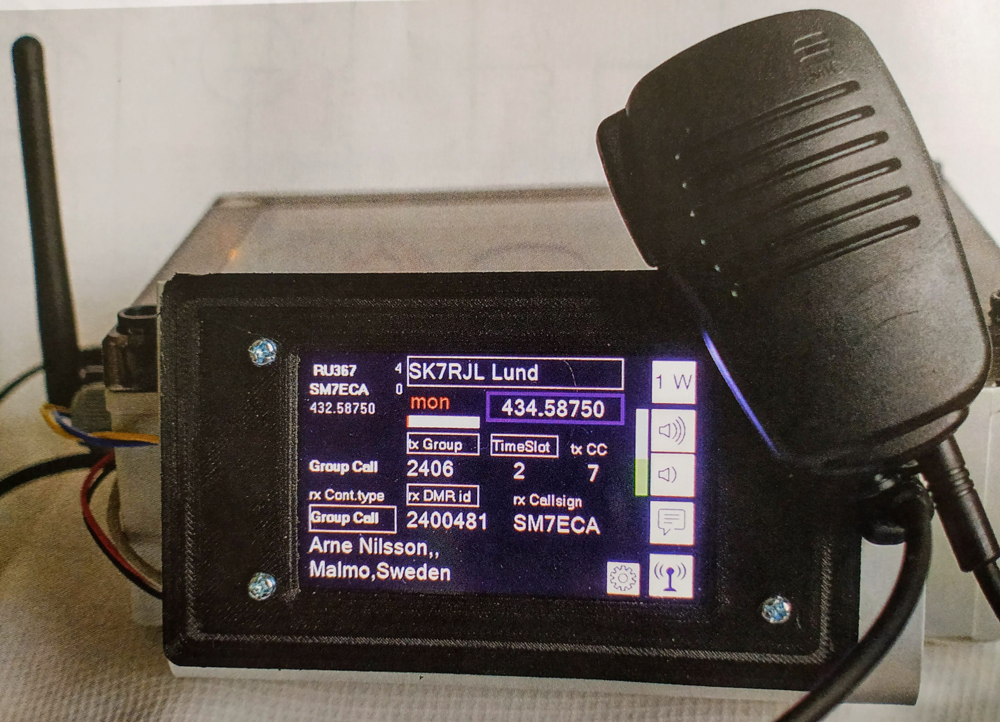

# Introduction

This project is intended to provide an Arduino based controller for a DMR board
that can be controlled from a Nextion display.

# Installation

## Linux - Arch Linux

    sudo pacman -Sy arduino arduino-avr-core arduino-cli

## Linux - Ubuntu

    sudo apt install arduino arduino-cli

## Linux - Building inside a Docker container

This has the advantage that we would avoid installing all the necessary dependencies
on our system.

	docker 

## Windows
Download the latest binaries from [software page](https://www.arduino.cc/en/software).

# References

* [Missing dependencies in Arch Linux](https://bugs.archlinux.org/task/60378)
* [Building inside a docker container](https://hub.docker.com/r/arduino/arduino-cli)
* [Arduino CLI - getting started](https://arduino.github.io/arduino-cli/latest/getting-started/)