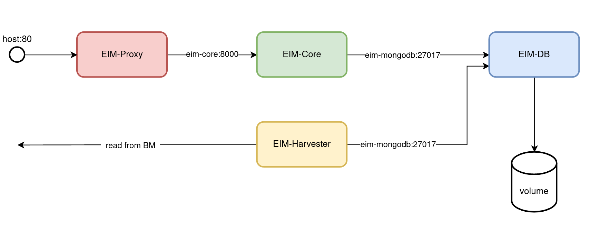

# EIM Service

## Introduction

The EIM is an abbreviation for **E**xternal **I**nformation **M**anagement. The main purpose of EIM is to support the DMR box by providing
information about DMR repeater, hotspots and users harvested from
different sources in the Internet.

The service is made of 4 Docker containers. This helps us to be able to avoid dependencies to the system we will deploy EIM to. A tool called _docker-compose_ is used to describe how the containers are interconnected and which version to deploy. All of those versions are stored on _DockerHub_ and have to be pulled to the server.

We are striving for automated deployment in order to ensure that everything will end up where it is supposed to be. A tool called _Ansible_ is helping us with that. The process is described in what is called a playbook. A playbook in turn is divided into tasks that are executed one by one over an SSH connection towards a given server. This makes the whole process repeatable. Furthermore when a service crashes we will be able to redeploy in a couple of minutes.

## Further Reading

* [eim-deployment](eim-deployment.md)
